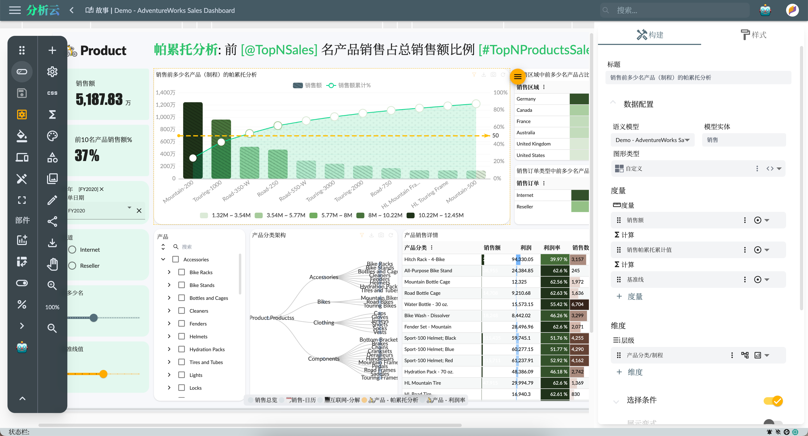
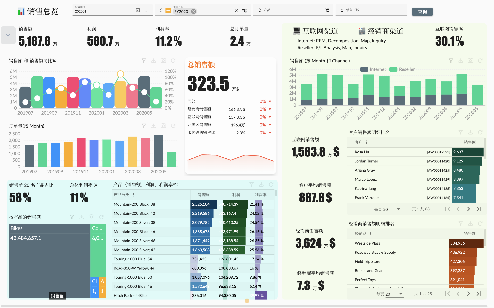
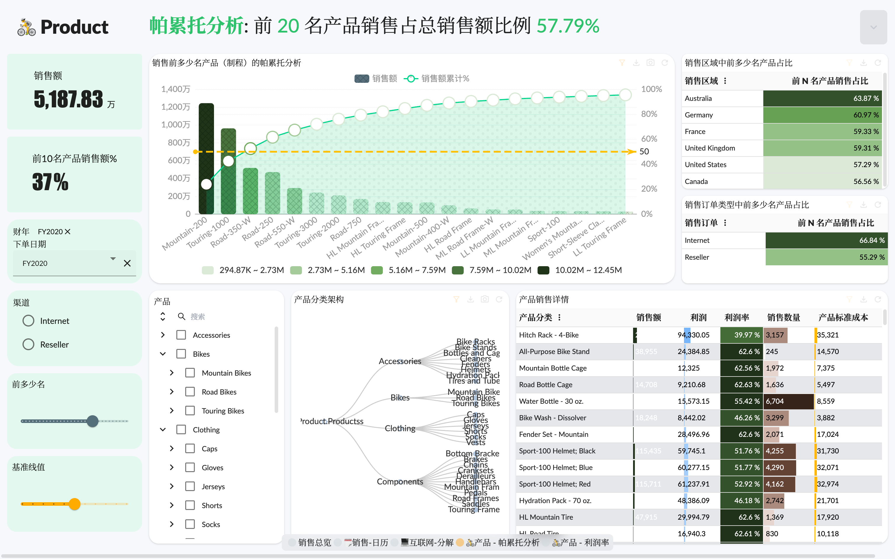
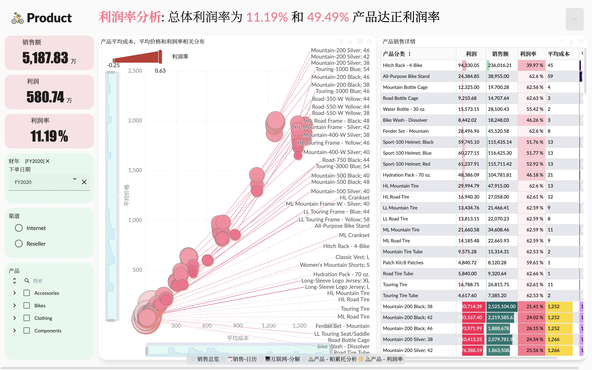
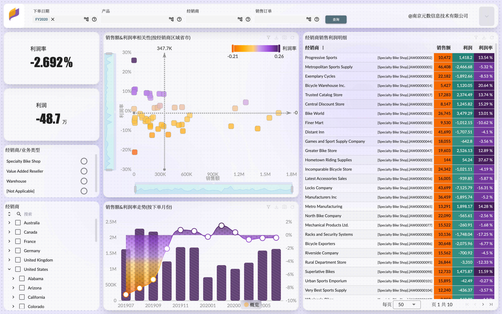
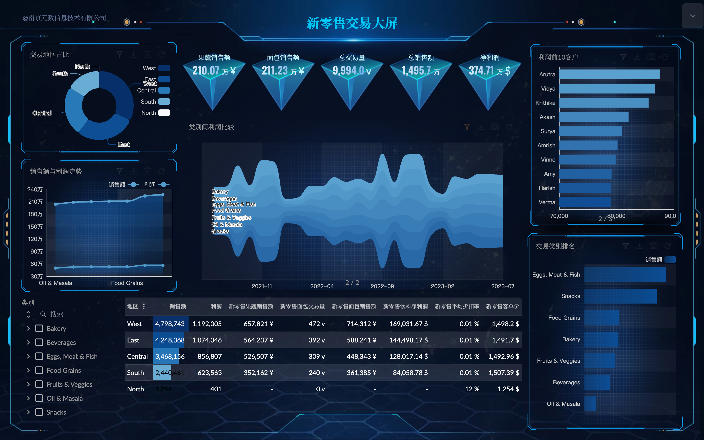
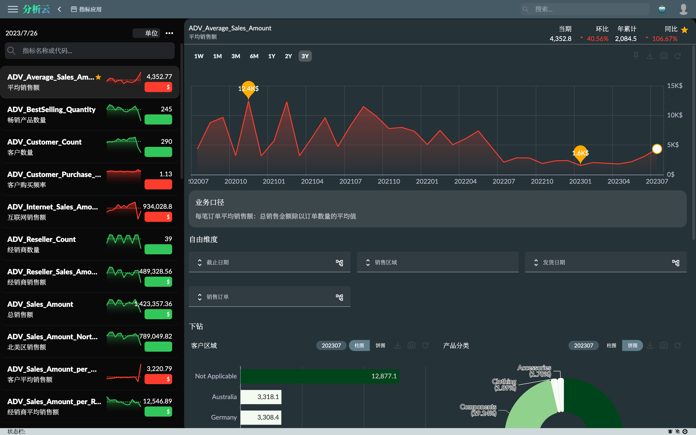
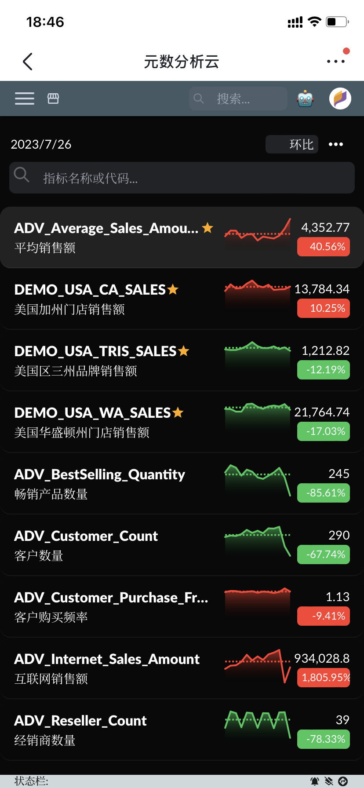

English | [中文](#元数分析云)

# Metad Analytics Cloud

Welcome to the Metad Analytics Cloud GitHub page!

Metad Analytics Cloud is a powerful cloud-based analytics platform that empowers organizations to extract valuable insights from their data. With advanced analytics capabilities, interactive visualizations, and AI-driven insights, Metad Analytics Cloud enables data-driven decision-making and helps organizations uncover hidden patterns and trends in their data.

[Metad Product Repository](https://github.com/meta-d/ocap)

[Metad Official Website](https://mtda.cloud/en/)

[Metad Official Homepage on bilibili](https://space.bilibili.com/3493144465246852)

## Key Features

- **Multi-Dimensional Analytics**: Perform multi-dimensional data analysis and modeling, allowing users to explore data from various dimensions and hierarchies.
- **Interactive Data Exploration**: Leverage the Query Lab to experiment with data, perform ad-hoc queries, and discover new insights in an interactive environment.
- **AI-Assisted Decision Making**: Benefit from AI-driven insights and recommendations to enhance decision-making processes and identify actionable opportunities.
- **Indicator Management**: Easily define, manage, and monitor key performance indicators (KPIs) to ensure data quality, consistency, and effective performance analysis.
- **Story Dashboards**: Create compelling visual narratives with Story Dashboards, combining interactive visualizations, narrative elements, and data-driven storytelling.
- **Big Screen Display**: Showcase your dashboards and visualizations on large screens, providing real-time monitoring and impactful presentations for meetings and command centers.
- **Seamless Integration with MPP DB**: Metad Analytics Cloud seamlessly integrates with the MPP databases (e.g. Apache Doris, Starrocks), leveraging its parallel computing capabilities for efficient data processing. Harness the full potential of db cluster's MPP engine for fast and scalable data analysis.

## Getting Started

To get started with Metad Analytics Cloud, please refer to the [documentation](https://mtda.cloud/en/docs/) for installation instructions, user guides, and API documentation. You can also explore the provided examples and sample code in the repository.

## Contributing

We welcome contributions from the community! If you have any ideas, bug reports, or feature requests, please submit them via GitHub issues. Pull requests are also encouraged for any enhancements or fixes.

## License

Metad Analytics Cloud core libraries is licensed under the [MIT License](LICENSE).

---

[English](#metad-analytics-cloud) | 中文

# 元数分析云

欢迎来到元数分析云的 GitHub 代码库！

元数分析云是一个功能强大的基于云的分析平台，赋予组织从数据中提取有价值的洞察力。通过先进的分析能力、交互式可视化和基于人工智能的洞察，元数分析云支持数据驱动的决策，并帮助组织发现数据中隐藏的模式和趋势。

## 主要特点

- **多维度分析**：进行多维数据分析和建模，让用户能够从不同维度和层次探索数据。
- **交互式数据探索**：利用查询实验室，实验性地查询数据、探索新的洞察，以交互式环境发现数据中的信息。
- **AI辅助决策**：通过基于人工智能的洞察和推荐，增强决策过程，发现可行的机会。
- **指标管理**：轻松定义、管理和监控关键绩效指标（KPI），确保数据质量、一致性和有效的绩效分析。
- **故事仪表板**：通过故事仪表板创建引人入胜的数据叙事，结合交互式可视化、叙事元素和数据驱动的叙事方式。
- **大屏展示**：将仪表板和可视化展示在大屏幕上，提供实时监控和令人印象深刻的演示，适用于会议和指挥中心。
- **与 MPP 数据库无缝集成**：元数分析云与 MPP 数据库（如Apache Doris、Starrocks）无缝集成，利用其并行计算能力实现高效的数据处理。充分利用数据库集群的 MPP 引擎的潜力进行快速和可扩展的数据分析。

## 入门指南

要开始使用元数分析云，请参阅[文档](https://mtda.cloud/docs/)以获取安装说明、用户指南和API文档。您也可以在代码库中探索提供的示例和样例代码。

## 贡献

我们欢迎社区的贡献！如果您有任何想法、错误报告或功能请求，请通过 GitHub issues 提交。对于任何改进或修复，我们也鼓励您提交 Pull Request。

## 许可证

元数分析云核心代码库采用 [MIT 许可证](LICENSE) 授权。

## Examples

* Story Workspace

* Sales overview [open in new tab](https://app.mtda.cloud/public/story/892690e5-66ab-4649-9bf5-c1a9c432c01b)

* Pareto analysis [open in new tab](https://app.mtda.cloud/public/story/892690e5-66ab-4649-9bf5-c1a9c432c01b?pageKey=bsZ0sjxnxI)

* Product profit analysis [open in new tab](https://app.mtda.cloud/public/story/892690e5-66ab-4649-9bf5-c1a9c432c01b?pageKey=6S4oEUnVO3)

* Reseller analysis [open in new tab](https://app.mtda.cloud/public/story/a58112aa-fc9c-4b5b-a04e-4ea9b57ebba9?pageKey=nrEZxh1aqp)

* Bigview dashboard [open in new tab](https://app.mtda.cloud/public/story/9c462bea-89f6-44b8-a35e-34b21cd15a36)

* Indicator application [open in new tab](https://www.mtda.cloud/blog/2023/07/24/sample-adv-7-indicator-app)

* Indicator mobile app [open in new tab](https://www.mtda.cloud/blog/2023/07/24/sample-adv-7-indicator-app)

